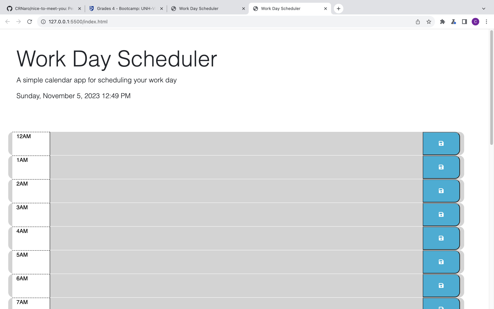
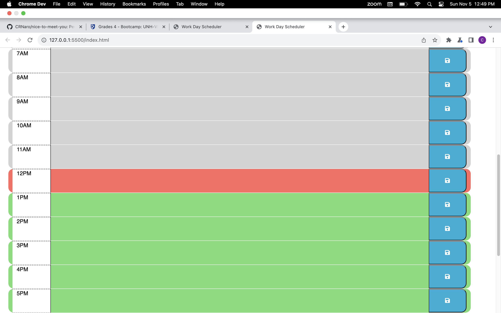
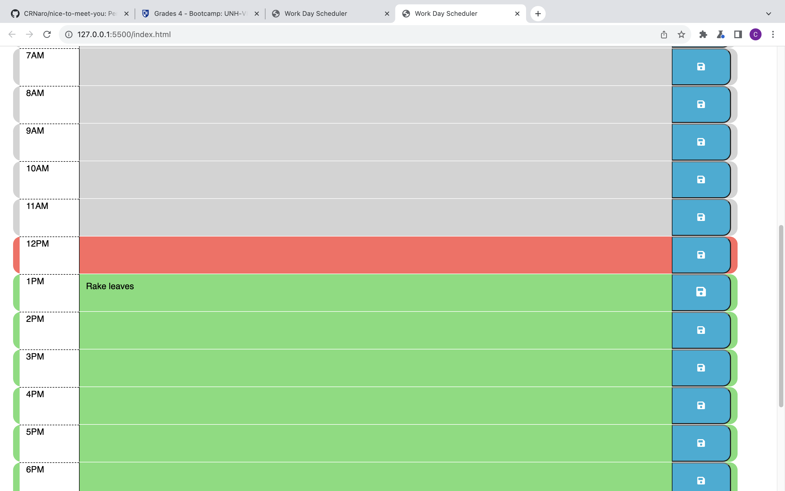
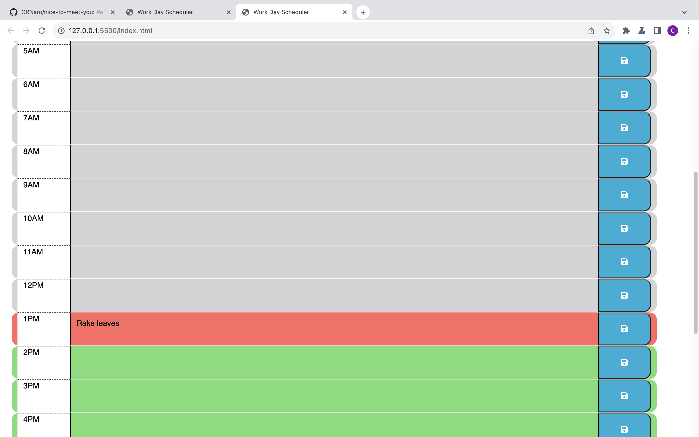

# pencil-me-in-05
Schedule/organizer

## Table of Content

## Description

I find myself needing to keep track of my projects and schedule time to get everything that I need to finished before the day ends.  This project of a day planner should help.

## Usage

<Provide instructions and examples for use. Include screenshots as needed.>
App instructions begin with loading the app from the provided URL. Scroll to the current time and notice that the color indicates time of the day.  Past time is gray, present time is red and future time is green.  You can post a project or event in any of the text boxes provided.  Then click the save button provided to the right to save your project or event in that time slot.  As the day progresses the color change should help to remind you that your event is coming up.  Once project is finished, you may delete the text and then press save to save the open box.  Note that saving text or deleted text will save even if the page is refreshed.  

## Acknowledgments

Referenced following websites:

- https://codetheweb.blog/
- https://stackoverflow.com
- https://www.w3schools.com
- https://forum.codewithmosh.com/
- Special thanks to Xpert, the AI Learning Assistant, for providing valuable assistance and guidance.

## License

---MIT License

Copyright (c) [2023] [Christopher Robert Naro]

Permission is hereby granted, free of charge, to any person obtaining a copy
of this software and associated documentation files (the "Software"), to deal
in the Software without restriction, including without limitation the rights
to use, copy, modify, merge, publish, distribute, sublicense, and/or sell
copies of the Software, and to permit persons to whom the Software is
furnished to do so, subject to the following conditions:

The above copyright notice and this permission notice shall be included in all
copies or substantial portions of the Software.

THE SOFTWARE IS PROVIDED "AS IS", WITHOUT WARRANTY OF ANY KIND, EXPRESS OR
IMPLIED, INCLUDING BUT NOT LIMITED TO THE WARRANTIES OF MERCHANTABILITY,
FITNESS FOR A PARTICULAR PURPOSE AND NONINFRINGEMENT. IN NO EVENT SHALL THE
AUTHORS OR COPYRIGHT HOLDERS BE LIABLE FOR ANY CLAIM, DAMAGES OR OTHER
LIABILITY, WHETHER IN AN ACTION OF CONTRACT, TORT OR OTHERWISE, ARISING FROM,
OUT OF OR IN CONNECTION WITH THE SOFTWARE OR THE USE OR OTHER DEALINGS IN THE
SOFTWARE.

🏆 The previous sections are the bare minimum, and your project will ultimately determine the content of this document. You might also want to consider adding the following sections.

## Features

- CSS design
- JavaScript

# SCHEDULE/ORGANIZER 
